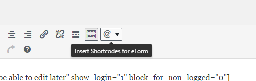
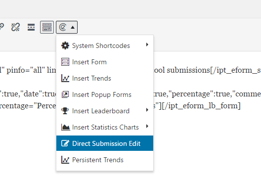
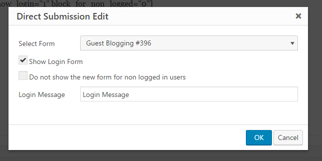
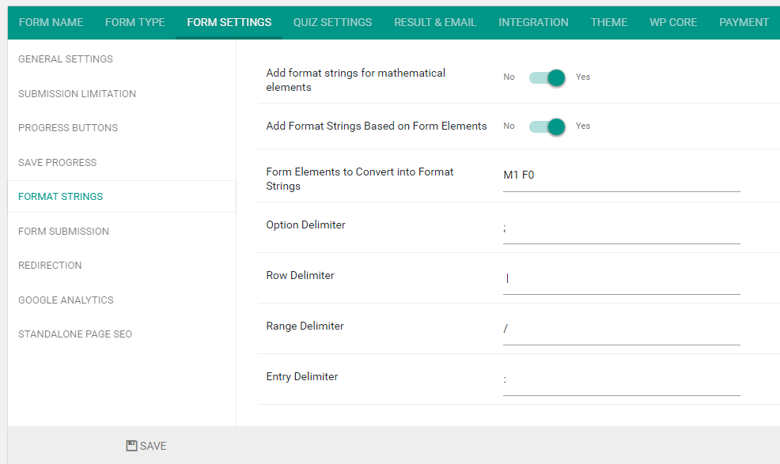

# eForm easySubmission Add-on

* Contributors: WPQuark
* Tags: fsqm, form, database
* Requires at least: 3.5
* Tested up to: 4.7
* License: GPLv3
* License URI: http://www.gnu.org/licenses/gpl-3.0.html

> Provides a bunch of functionality to handle submissions effectively

## Description
---------------

The plugin provides following functionality:

1. The system would accept a new shortcode `[ipt_fsqm_sutb id="1" show_login="1" block_for_non_logged="1" msg="Please login to edit your previous submission"]`
2. The shortcode would render submission for for non logged in users and logged in users who have not submitted the form yet.
3. The shortcode would render the edit form for logged in users who have submitted the form.
4. Enhances the format strings to include any form elements on format strings ( Works for eForm v3.7.1 ).

### Shortcode Attributes:

 * `id` (int) : The ID of the form.
 * `show_login` (0 | 1) : If user is not logged in, then show a login form to the user. The message of the form can be customized.
 * `block_for_non_logged` (0 | 1) : If enabled then the new submission for would not show up for non logged in users. This will only work if the Show Login Form is enabled.
 * `msg` (string) : Message for Login Form.

### Using the Shortcode Generator:

You do not need to manually put the shortcode yourself. Just do the following steps:

* Create/Edit any Page from WordPress Admin.
* Click on the `eForm Shortcode Generator`.

> 

* Click on `Direct Submission Edit` button.

> 

* Fill out the form accordingly and click on insert. shortcode-generator-form.png

> 

### Enabling Extended Format Strings

> 

* Go to FORM SETTINGS > FORMAT STRINGS.
* Enable `Add Format Strings Based on Form Elements`.
* Either enter `all` or mention specific elements in `Form Elements to Convert into Format Strings`.
* Configure other options.

## Installation
---------------

Install like any other WordPress Plugin.

1. Upload `eform-easy-submission` to the `/wp-content/plugins/` directory
2. Activate the plugin through the 'Plugins' menu in WordPress
3. The plugin would be named `eForm easySubmission Add-on` under 'Plugins' menu

## Changelog
------------

Please refer to [ChangeLog](changelog) file.
